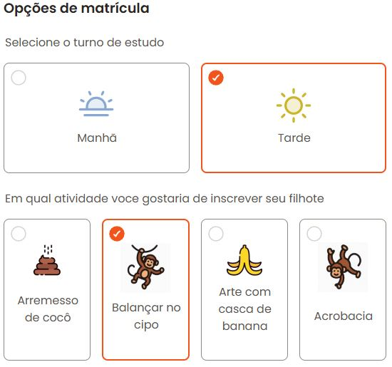

# Formulário de matrícula
Este é um projeto que busca criar um cadastro padrão, no exemplo em questão para uma escola primária. 
Usei do chatgpt para criação da imagem localizada no aside e em alguns icones. 
O projeto é uma forma de aplicar o conhecimento sobre o forms do HTML5, junto de varias utilidades do CSS3. 
O site conta com campos como:
- Nome completo
- Envio de documento
- Requisição de e-mail do responsável
- escolha de turno e atividades

### Demonstração
- Aside do projeto: 

- Opções da matrícula: 

### Tecnologias
- HTML5 (tags semanticas e forms(fieldsets, labels, inputs e etc.)) 
- CSS3 (paginas de estilo indexadas para melhor organização, variaveis, pseudoclasses e etc.)

Você pode ver o site do projeto aqui: https://lucasaxdcosta.github.io/cadastro-banana-feliz/
